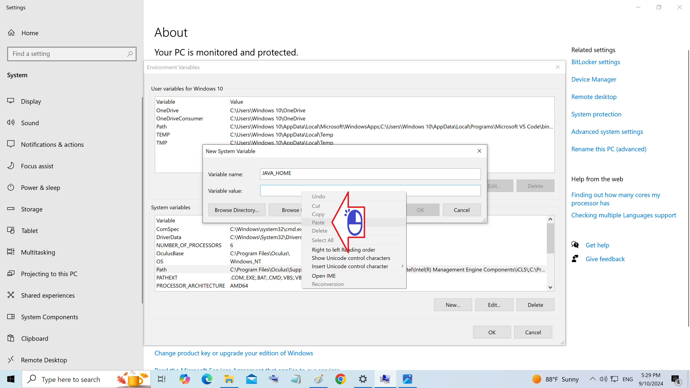

# ウィンドウズシステムレジストリ

システムレジストリにアクセスする方法

絵 01 - 「環境変数」をクリックします

絵 02 - 「New」をクリックします

絵 03 - 変数名ボックスに「JAVA_HOME」と入力します

絵 04 - 変数値ボックスを右クリックします

絵 05 - JDKが存在するアドレスを貼り付けます

絵 06 - 「OK」をクリックします

絵 07 - パスバーをクリックしてマークします

絵 08 - 「Edit」をクリックします

絵 09 - Oracle 標準リファレンスをクリックします

絵 10 - 「削除」をクリックします

絵 11 - 「OK」をクリックします

絵 12 - 「New」をクリックします

絵 13 - %JAVA_HOME%\binと入力して「OK」をクリックします

絵 14 - 「OK」をクリックします

