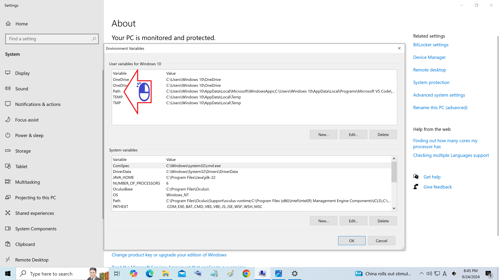
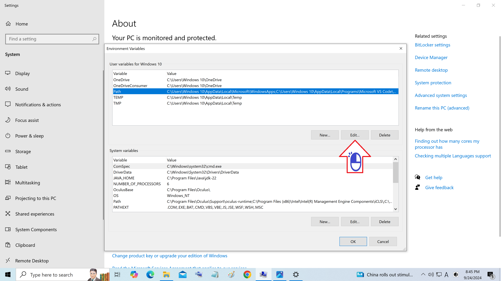
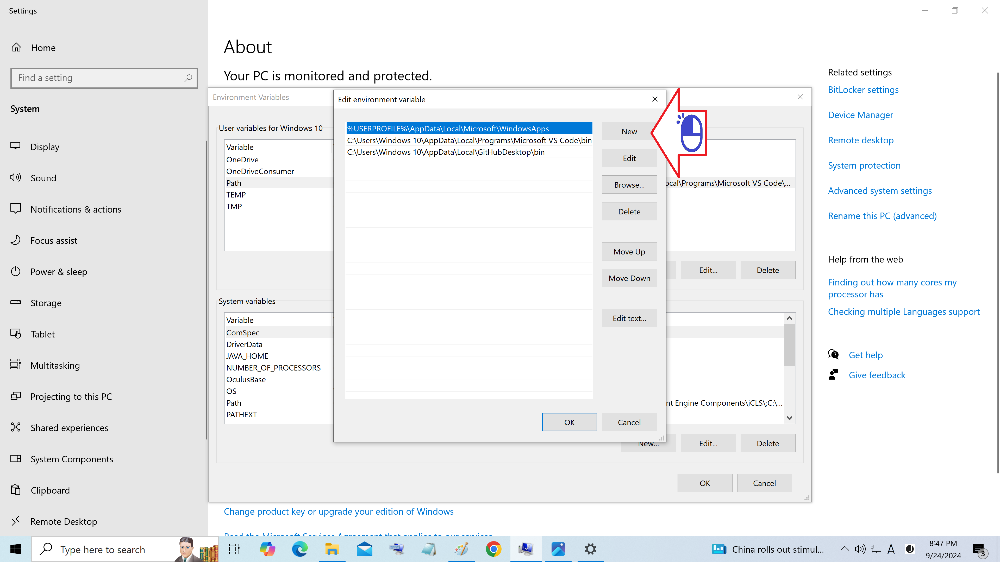
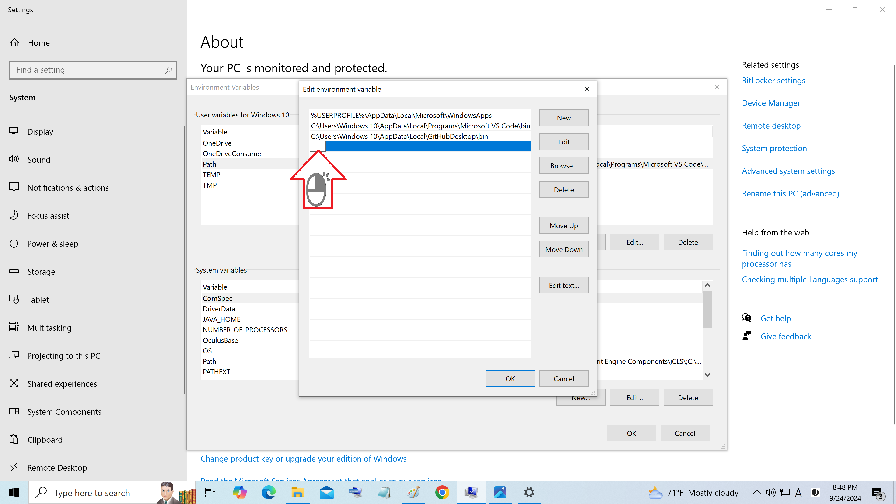
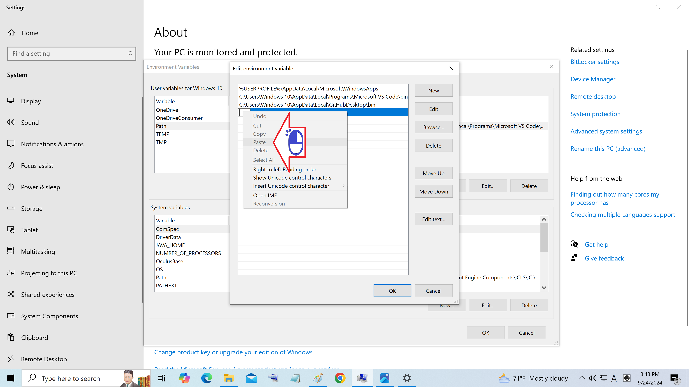
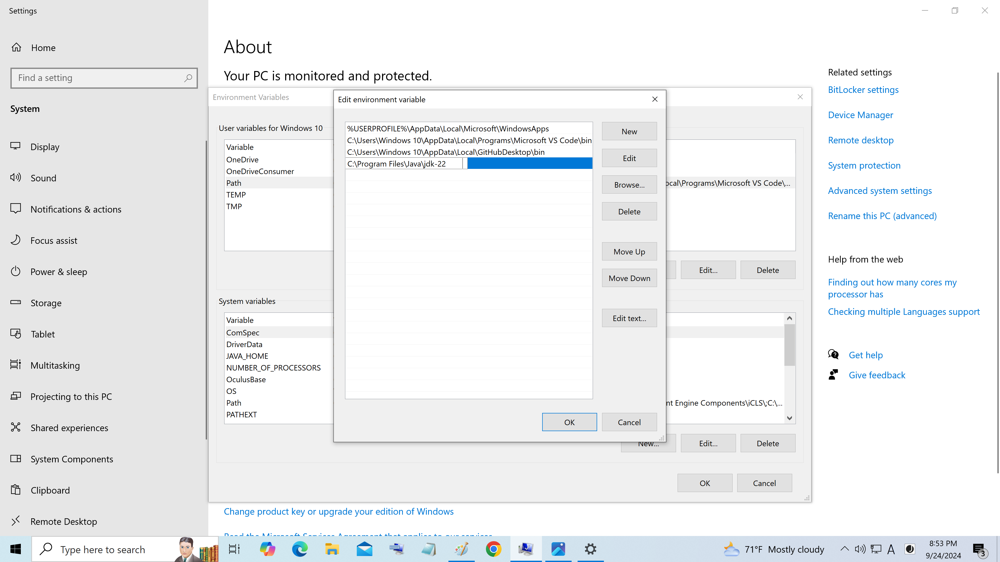

# Registro do sistema do Windows

Como acessar o registro do sistema

Figura 01 - Clique Variaveis de Ambiente

Figura 02 - Clique Delete

Figura 03 - Clique OK

Figura 04 - Clique New

Figura 05 - Clique com o botão direito a barra

Figura 06 - Clique Paste

Figura 07 - Path do JDK

Figura 08 - Acrescente o bin e clique OK

Figura 09 - Clique OK

