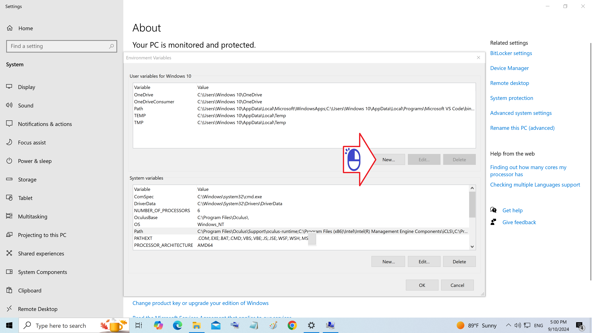
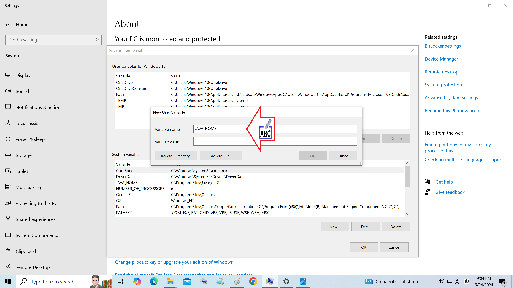
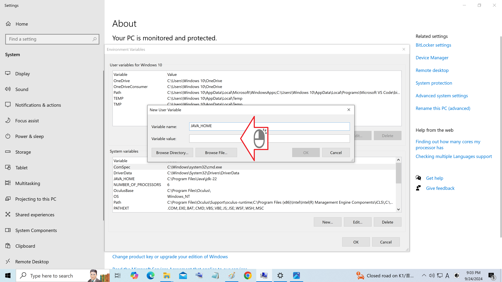
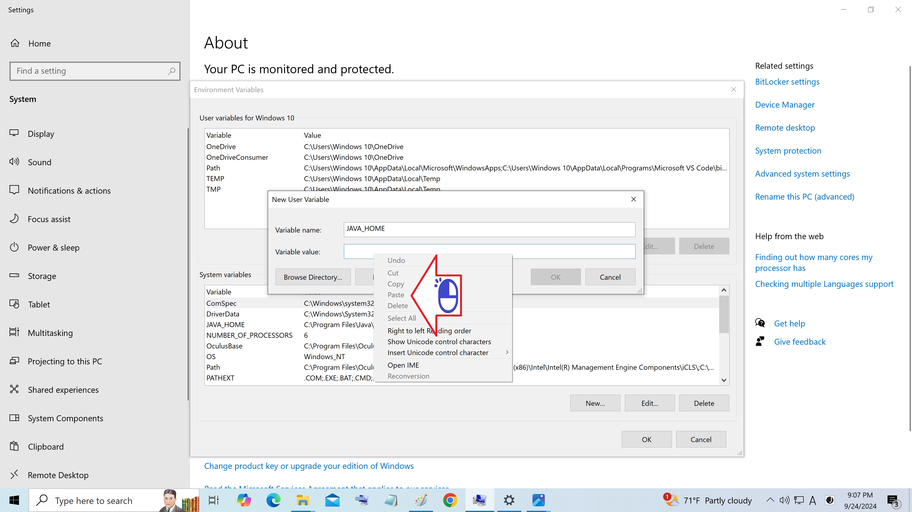
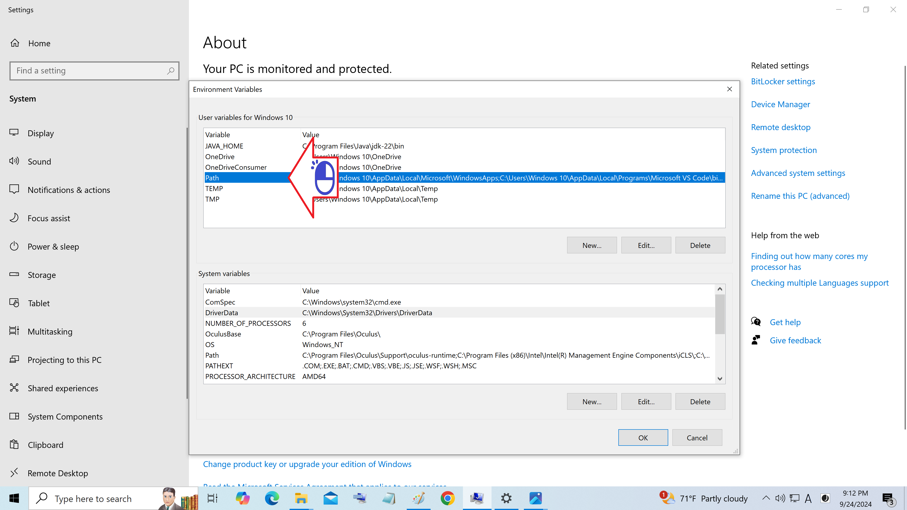
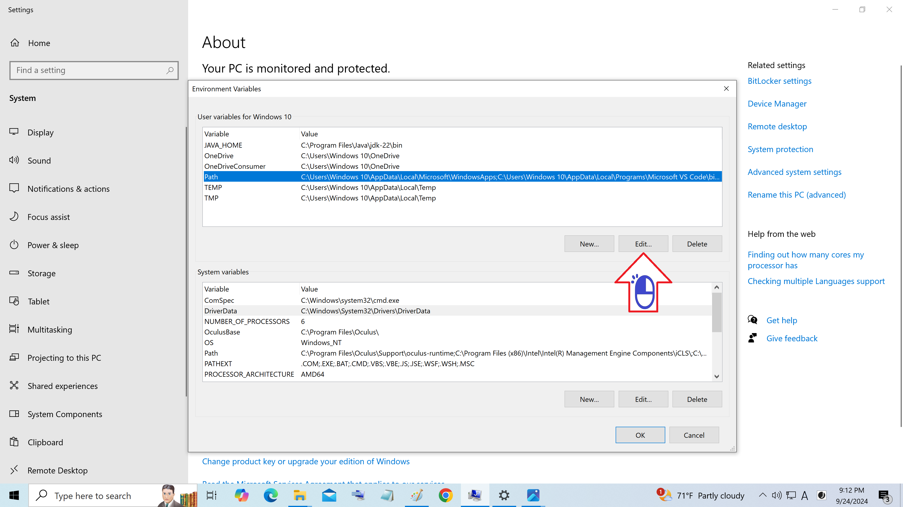
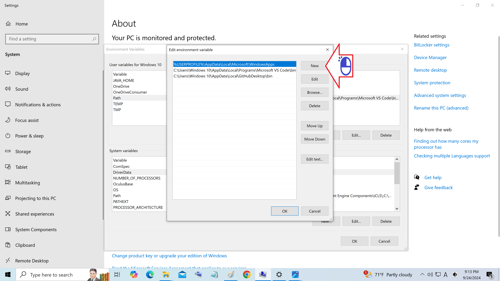
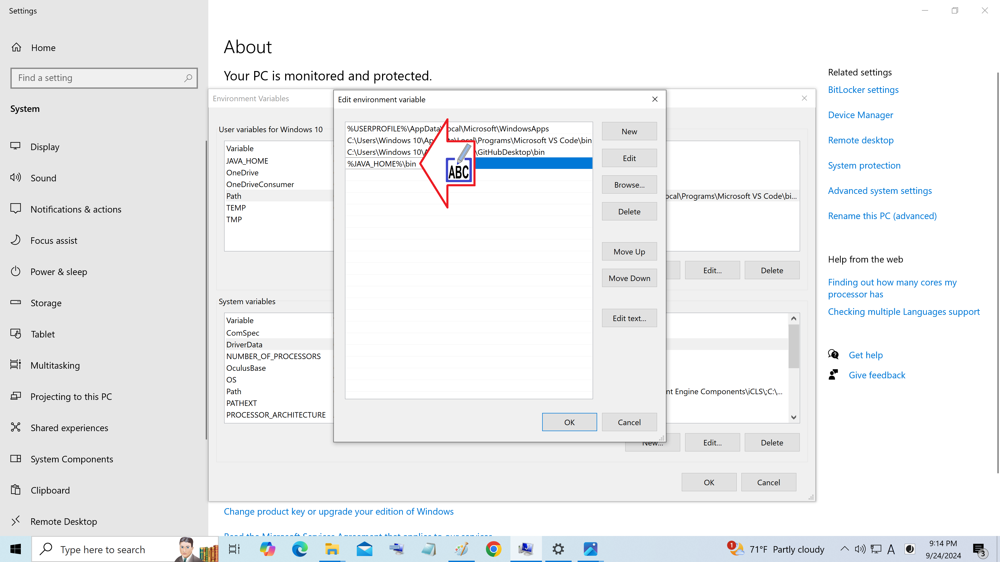
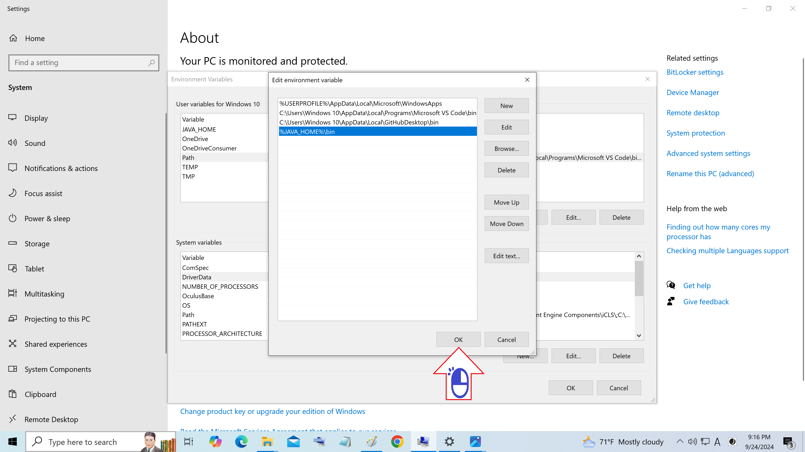

# Registro do usuario do Windows

Como acessar o registro do usuario

Figura 01 - Clique Variaveis de Ambiente

Figura 02 - Clique New

Figura 03 - Digite JAVA_HOME na caixa nome variavel

Figura 04 - Clique com o botão direito na caixa valor da variavel

Figura 05 - Cole o endereço onde esta o jdk

Figura 06 - Clique OK

Figura 07 - Marque a barra do Path clicando nele

Figura 08 - Clique Edit

Figura 09 - Clique New

Figura 10 - Digite %JAVA_HOME%\bin e clique OK

Figura 11 - Clique OK

