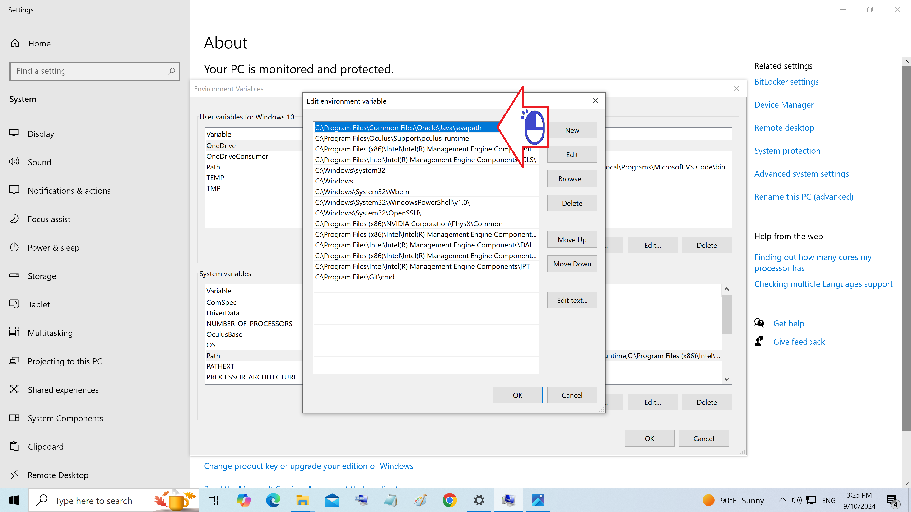
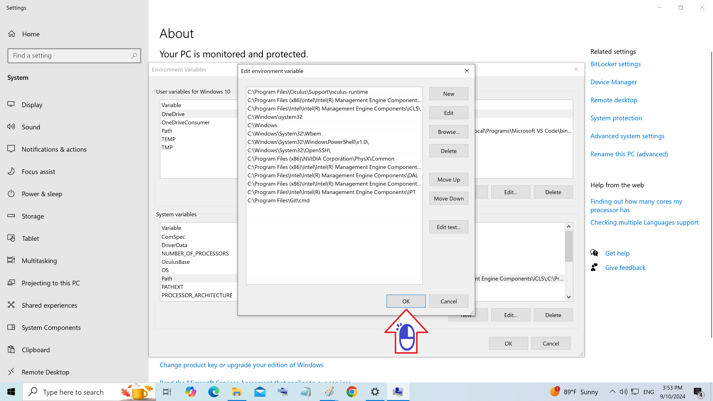

# Registro do sistema do Windows

Como acessar o registro do sistema

Figura 01 - Clique Variaveis de Ambiente

Figura 02 - Clique Path

Figura 03 - Clique Edite

Figura 04 - Clique na referencia padrao Oracle

Figura 05 - Clique Delete

Figura 06 - Clique OK

Figura 07 - Clique New

Figura 08 - Clique com o botão direito a barra

Figura 09 - Clique Paste

Figura 10 - Path do JDK

Figura 11 - Acrescente o bin e clique OK

Figura 12 - Clique OK

