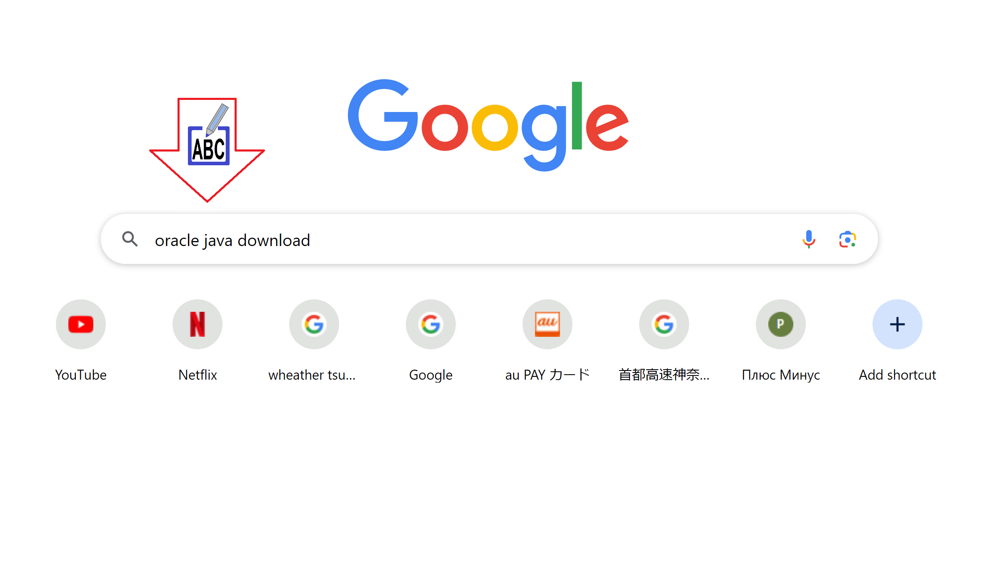
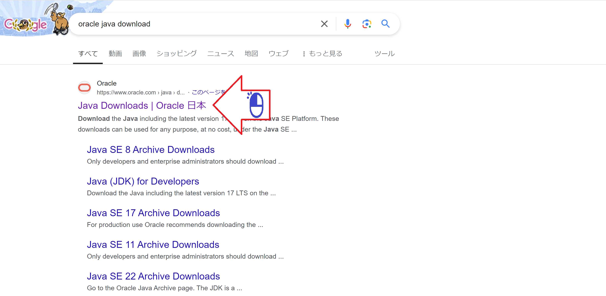
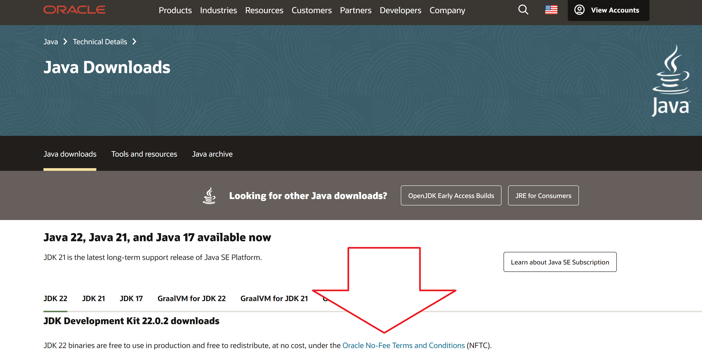
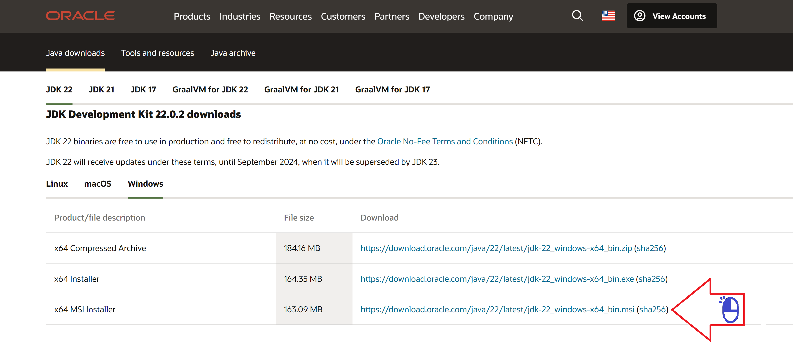

# Download Java-JDK

Baixando o Java-JDK para aplicativos android

Figura 01 - Buscando o Site do Java-JDK no Google

Figura 02 - Oracle empresa que controla o Java

Figura 03 - Procurando o link do download

Figura 04 - Java-JDK para o Windows

