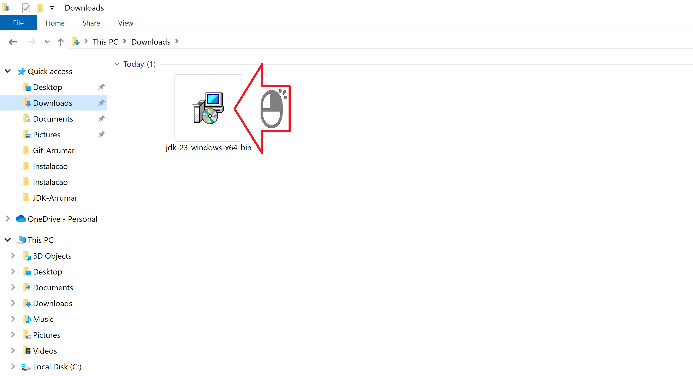
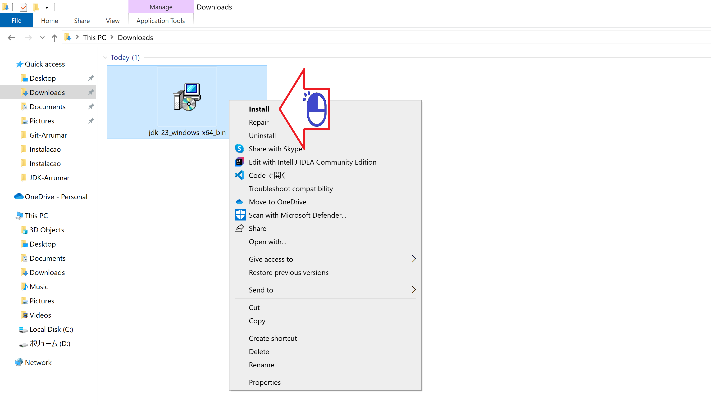
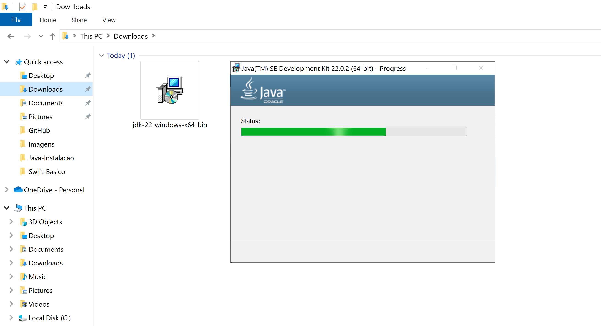

# Instalação Java-JDK

Instalando o arquivo baixado no site da Oracle

Figura 01 - Buscando o Site do Java-JDK no Google

Figura 02 - Informação sobre o sistema que sera instalado

Figura 03 - IMPORTANTE-Local onde o pacote sera instalado

Figura 04 - Progresso da instalação

Figura 05 - Conclusão do processo

