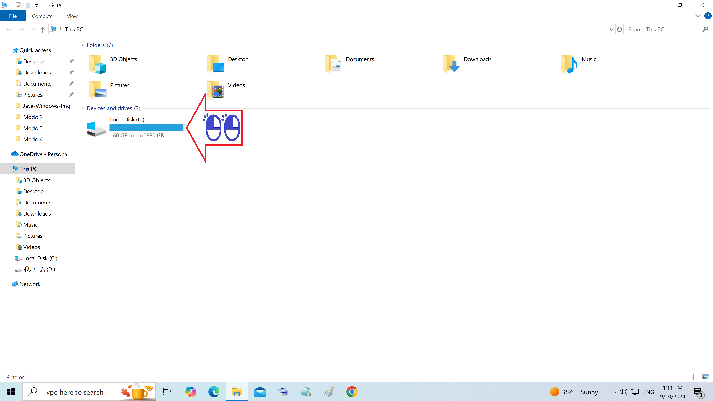
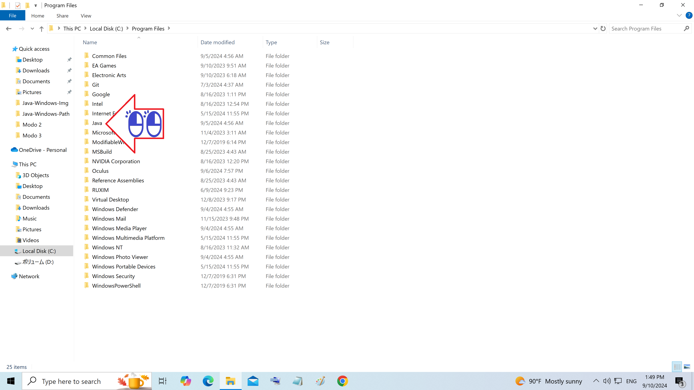
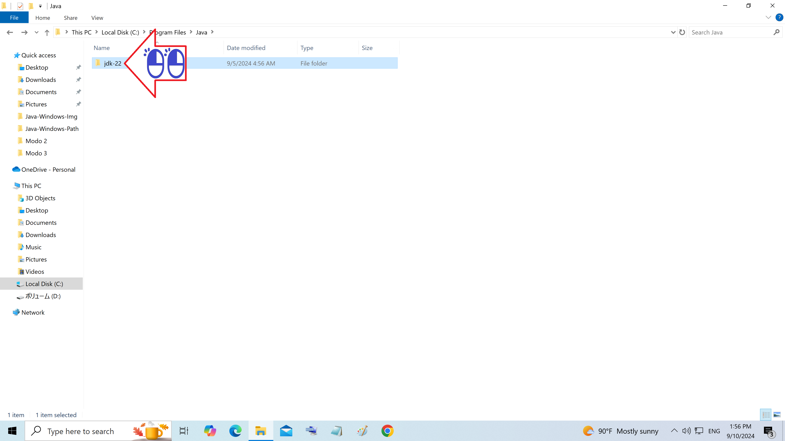
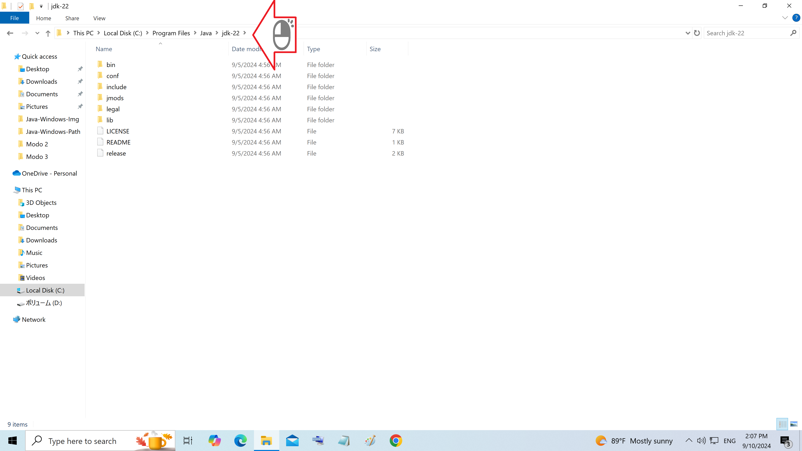
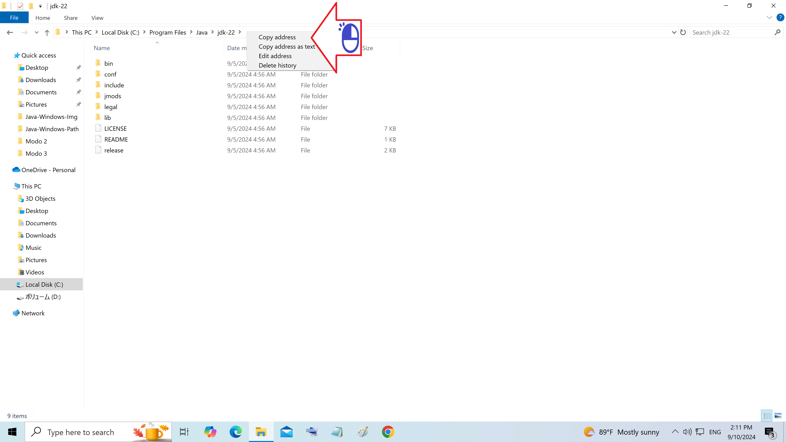

# Caminho do Java-JDK (Path)

Informação necessario no registro de Sistema

Figura 01 - Duplo Clique em This PC (Este Computador)

Figura 02 - Duplo Clique em Local Disk C:

Figura 03 - Duplo Clique em Java

Figura 04 - Duplo Clique no jdk

Figura 05 - Clique com o botão direito na barra de endereço

Figura 06 - Copie o endereço do jdk

