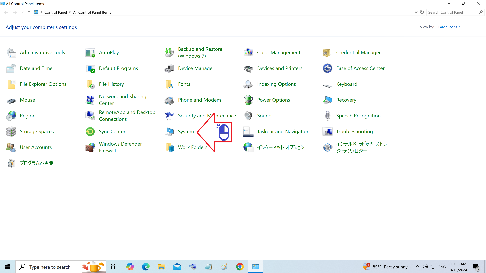

# Registro do sistema do Windows

Como acessar o registro do sistema

Figura 01 - Digite Painel de Controle na caixa de procura

Figura 02 - Clique em Painel de Controle

Figura 03 - Clique em Sistema

Figura 04 - Clique em Configuracão avançada

Figura 05 - Clique em variaveis do ambiente

